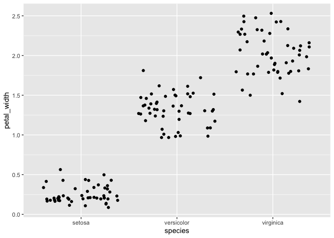
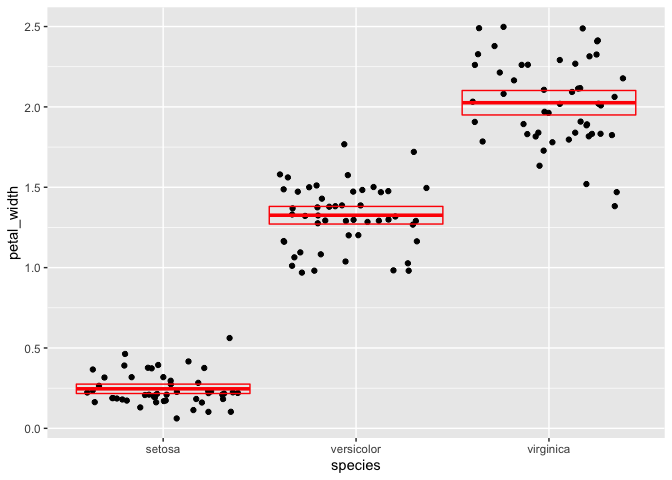
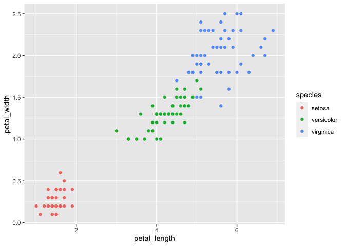

README
================
Rose Lakeman
2021-02-22

Welcome to my Lab 5 repository for Quantitative Biology BIOL 275 at
MSUM.

The objectives of this lab are: Rename variables

  - Create new variables
  - Summarize a dataset
  - Summarize a dataset by groups
  - Visualize the relationship between variables
  - Numerical and categorical variable
  - Two numerical variables
  - Three variables

Question 1 : Rename each variable so that it is all lower-case and uses
an underscore \_ instead of a period . in the name (the recommended
coding style in the tidyverse style guide). Print the resulting table.

``` r
# Load Packages -----------------------------------------------------------

library(tidyverse)
```

    ## ── Attaching packages ─────────────────────────────────────── tidyverse 1.3.0 ──

    ## ✓ ggplot2 3.3.3     ✓ purrr   0.3.4
    ## ✓ tibble  3.0.4     ✓ dplyr   1.0.2
    ## ✓ tidyr   1.1.2     ✓ stringr 1.4.0
    ## ✓ readr   1.4.0     ✓ forcats 0.5.0

    ## ── Conflicts ────────────────────────────────────────── tidyverse_conflicts() ──
    ## x dplyr::filter() masks stats::filter()
    ## x dplyr::lag()    masks stats::lag()

``` r
iris <- as_tibble(iris) # so it prints a little nicer
iris
```

    ## # A tibble: 150 x 5
    ##    Sepal.Length Sepal.Width Petal.Length Petal.Width Species
    ##           <dbl>       <dbl>        <dbl>       <dbl> <fct>  
    ##  1          5.1         3.5          1.4         0.2 setosa 
    ##  2          4.9         3            1.4         0.2 setosa 
    ##  3          4.7         3.2          1.3         0.2 setosa 
    ##  4          4.6         3.1          1.5         0.2 setosa 
    ##  5          5           3.6          1.4         0.2 setosa 
    ##  6          5.4         3.9          1.7         0.4 setosa 
    ##  7          4.6         3.4          1.4         0.3 setosa 
    ##  8          5           3.4          1.5         0.2 setosa 
    ##  9          4.4         2.9          1.4         0.2 setosa 
    ## 10          4.9         3.1          1.5         0.1 setosa 
    ## # … with 140 more rows

``` r
# Answering Assignment Questions ------------------------------------------

#Question 1

i2 <- rename(
  iris, 
  sepal_length = Sepal.Length,
  sepal_width = Sepal.Width,
  petal_length = Petal.Length,
  petal_width = Petal.Width,
  species = Species
  )
i2
```

    ## # A tibble: 150 x 5
    ##    sepal_length sepal_width petal_length petal_width species
    ##           <dbl>       <dbl>        <dbl>       <dbl> <fct>  
    ##  1          5.1         3.5          1.4         0.2 setosa 
    ##  2          4.9         3            1.4         0.2 setosa 
    ##  3          4.7         3.2          1.3         0.2 setosa 
    ##  4          4.6         3.1          1.5         0.2 setosa 
    ##  5          5           3.6          1.4         0.2 setosa 
    ##  6          5.4         3.9          1.7         0.4 setosa 
    ##  7          4.6         3.4          1.4         0.3 setosa 
    ##  8          5           3.4          1.5         0.2 setosa 
    ##  9          4.4         2.9          1.4         0.2 setosa 
    ## 10          4.9         3.1          1.5         0.1 setosa 
    ## # … with 140 more rows

Question 2: Convert the four numerical variables from cm to mm by
multiplying by 10. Print the resulting table.

``` r
#Question 2

numerical_mm <- mutate(i2, 
       sepal_length = sepal_length * 10,
       sepal_width = sepal_width * 10,
       petal_length = petal_length * 10,
       petal_width = petal_width * 10
       )
numerical_mm
```

    ## # A tibble: 150 x 5
    ##    sepal_length sepal_width petal_length petal_width species
    ##           <dbl>       <dbl>        <dbl>       <dbl> <fct>  
    ##  1           51          35           14           2 setosa 
    ##  2           49          30           14           2 setosa 
    ##  3           47          32           13           2 setosa 
    ##  4           46          31           15           2 setosa 
    ##  5           50          36           14           2 setosa 
    ##  6           54          39           17           4 setosa 
    ##  7           46          34           14           3 setosa 
    ##  8           50          34           15           2 setosa 
    ##  9           44          29           14           2 setosa 
    ## 10           49          31           15           1 setosa 
    ## # … with 140 more rows

Question 3: Calculate sepal area and petal area (area is equal to length
multiplied by width). Print a table with only the variables sepal area,
petal area, and species.

``` r
i3 <- mutate(i2, sepal_area = sepal_length * sepal_width,
       petal_area = petal_length * petal_width)  

i4 <- select(i3, sepal_area, petal_area, species)
i4
```

    ## # A tibble: 150 x 3
    ##    sepal_area petal_area species
    ##         <dbl>      <dbl> <fct>  
    ##  1       17.8      0.280 setosa 
    ##  2       14.7      0.280 setosa 
    ##  3       15.0      0.26  setosa 
    ##  4       14.3      0.3   setosa 
    ##  5       18        0.280 setosa 
    ##  6       21.1      0.68  setosa 
    ##  7       15.6      0.42  setosa 
    ##  8       17        0.3   setosa 
    ##  9       12.8      0.280 setosa 
    ## 10       15.2      0.15  setosa 
    ## # … with 140 more rows

Question 4: Calculate the following statistics for the entire dataset
from the sepal length variable and print the resulting table:

``` r
i5 <- summarize(i3, sampl_size = n(),
          sl_max = max(sepal_length),
          sl_min = min(sepal_length),
          sl_range = sl_max - sl_min,
          sl_median = median(sepal_length),
          sl_iqr = IQR(sepal_length),
          q1 = quantile(sepal_length, probs = 0.25),
          q2 = quantile(sepal_length, probs = 0.75)
          )
 i5
```

    ## # A tibble: 1 x 8
    ##   sampl_size sl_max sl_min sl_range sl_median sl_iqr    q1    q2
    ##        <int>  <dbl>  <dbl>    <dbl>     <dbl>  <dbl> <dbl> <dbl>
    ## 1        150    7.9    4.3      3.6       5.8    1.3   5.1   6.4

Question 5: Calculate the following statistics for each species from the
petal width variable and print the resulting table:

``` r
i3_grouped <- group_by(i3, species)
 
 summarize(i3_grouped, sampl_size = n(),
           pw_mean = mean(petal_width),
           pw_sd = sd(petal_width),
           pw_variance = var(petal_width),
           pw_sem = pw_sd/ sqrt(sampl_size),
           pw_95upper = pw_mean + 1.96 * pw_sem,
           pw_95lower = pw_mean - 1.96 * pw_sem
 )
```

    ## `summarise()` ungrouping output (override with `.groups` argument)

    ## # A tibble: 3 x 8
    ##   species    sampl_size pw_mean pw_sd pw_variance pw_sem pw_95upper pw_95lower
    ##   <fct>           <int>   <dbl> <dbl>       <dbl>  <dbl>      <dbl>      <dbl>
    ## 1 setosa             50   0.246 0.105      0.0111 0.0149      0.275      0.217
    ## 2 versicolor         50   1.33  0.198      0.0391 0.0280      1.38       1.27 
    ## 3 virginica          50   2.03  0.275      0.0754 0.0388      2.10       1.95

Question 6: Visualize the relationship between petal width and species
using a strip plot.

``` r
ggplot(data = i2) +
   geom_jitter(mapping = aes(x = species, y = petal_width)) 
```

<!-- -->

Question 7: Starting with the previous graph, add the mean and 95%
confidence interval for each species

``` r
 pl_summary <- 
   summarize(i3_grouped, 
             pw_mean = mean(petal_width),
             pw_sem = sd(petal_width)/ sqrt(n()),
             pw_95upper = pw_mean + 1.96 * pw_sem,
             pw_95lower = pw_mean - 1.96 * pw_sem
   ) 
```

    ## `summarise()` ungrouping output (override with `.groups` argument)

``` r
 pl_summary
```

    ## # A tibble: 3 x 5
    ##   species    pw_mean pw_sem pw_95upper pw_95lower
    ##   <fct>        <dbl>  <dbl>      <dbl>      <dbl>
    ## 1 setosa       0.246 0.0149      0.275      0.217
    ## 2 versicolor   1.33  0.0280      1.38       1.27 
    ## 3 virginica    2.03  0.0388      2.10       1.95

``` r
 ggplot(data = i2) +
   geom_jitter(mapping = aes(x = species, y = petal_width)) +
   geom_crossbar(
     data = pl_summary,
     mapping = aes(x = species, y = pw_mean, 
                   ymax = pw_95upper,
                   ymin = pw_95lower),
     color = "red"
   )
```

<!-- -->

Question 8: Visualize the relationship between petal length, petal
width, and species using a scatterplot. Map the two numerical variables
to the x and y axes and map species to the color and shape aesthetics.

``` r
 ggplot(data = i2) +
   geom_point(mapping = aes(x = petal_length, y = petal_width, color = species))
```

<!-- -->
